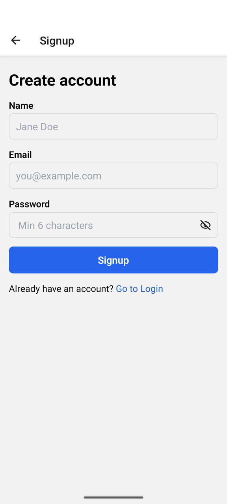
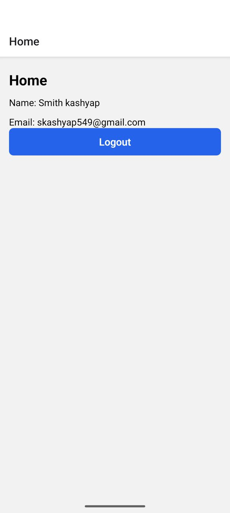

# RnAuthClean

A **React Native authentication app** implementing **Login, Signup, and Home screens** using **Clean Architecture**, **React Context API** for global authentication state, and **React Navigation**.  

The app demonstrates a modern, maintainable architecture for mobile apps.

---

## Features

- ✅ **Login Screen**  
  - Email & password input  
  - Validation for email format and password length  
  - Error messages for invalid credentials  

- ✅ **Signup Screen**  
  - Name, email, and password input  
  - Validation for empty fields, email format, password length  
  - Error messages for invalid input or duplicate email  

- ✅ **Home Screen**  
  - Displays currently logged-in user’s name and email  
  - Logout button to clear authentication state  

- ✅ **Persistent Authentication**  
  - Stores logged-in user in local storage  
  - Keeps user logged in across app restarts  

- ✅ **Clean Architecture**  
  - **Domain Layer:** Entities (`User`), Repositories, UseCases (`LoginUseCase`, `SignupUseCase`, `LogoutUseCase`)  
  - **Data Layer:** `AuthRepositoryImpl`, `LocalAuthSource`, DTOs, storage utils  
  - **Presentation Layer:** Screens (`Login`, `Signup`, `Home`), Context API (`AuthContext`), reusable UI components  

- ✅ **Reusable UI Components**  
  - `FormTextInput`  
  - `PasswordInput` with visibility toggle  
  - `PrimaryButton`  

- ✅ **Navigation**  
  - React Navigation Stack  
  - Conditional rendering based on authentication state  

---

## Screenshots / Demo

> Replace these with actual images or screen recording GIFs.  

  
  
  

---

## Setup Instructions

### 1. Clone the repository
```bash
git https://github.com/smithkashyapdev/RnAuthClean.git
cd RnAuthClean

npm install
# or
yarn install

# Install Pods (iOS only)
cd ios && pod install && cd ..

#Run Metro Bundler
npx react-native start

#Run on Android
npx react-native run-android

#Run on iOS (macOS only)
npx react-native run-ios